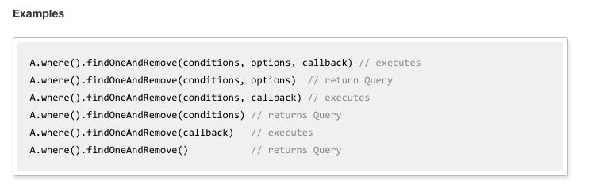

# lab5-arinehouse

# Links
* [Lab 5](https://github.com/dartmouth-cs52-17S/lab5-arinehouse) GitHub repo (that's this one!)
* [Heroku](https://redux-blog-backend.herokuapp.com/) Instance
* [Lab 4](https://redux-blog.surge.sh) Blog Site

# What I Did
A lot of what I did was just infer correct backend syntax and mongoose methods from short assignment 7. The good news is, repetition helps me learn, so I feel a little more comfortable interacting with databases. It's pretty nice not having to work with SQL to interact with the backend.

# What Worked/What Didn't
Dear Jesus the Mongoose documentation is bad. Look at this screenshot of a section where command-F kept taking me back to:

Look at that first comment. `//executes`. Yeah callback is a method of course it fucking executes omg

Anyway, all that aside, eventually I pushed my way through the syntax and got the backend for this to behave the same way as the original backend from lab 4, without crashes or random deletions of stuff from the database.

# Extra Credit
None this time. Sorry to disappoint :sob:
